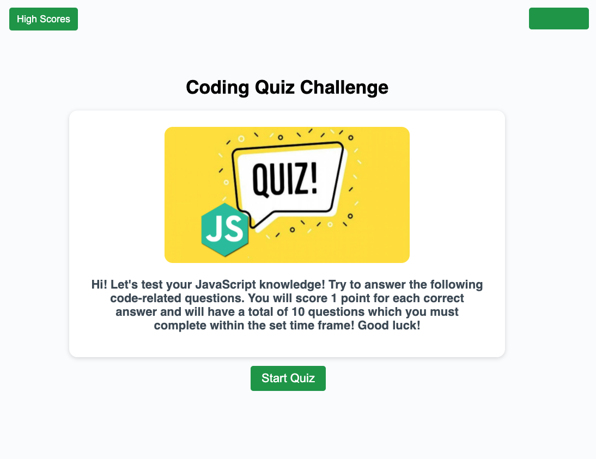

# Week 4 - Code Quiz

## Description

- I have been tasked to build a timed coding quiz with multiple-choice questions using JavaScript fundamentals. The quiz will include multiple questions alongside a timer. If a question is answered incorrectly then the time will be subtracted to the clock. Upon completion of the quiz then the user will be able to save their score alongside their initials.

## Acceptance Criteria - Checklist

- the quiz starts when the start button is clicked and clears the content to initialise the fist question and response options for the user.

- The timer also starts when the user commences the quiz and is displayed throughout the quiz

- Upon completion of the timer an alert appears informing the user that they are out of time and the quiz returns to the start once the user has acknowledged the alert.

- The timer also resets at this stage

- If the user scores atleast 7 correct answers out of 10 they are rewarded with a 'well done' message upon completion of the quiz and if they score 6 or less correct answers then the user is displayed a'better luck next time message.'

- Upon completion of the quiz a final score is diaplayed

---

## 'To do list' action plan (tasks i need to work on to complete my homework)

- Unfortunately I was unable to complete this homework and consequently unable to meet the homework criteria as well as my own personal expectations.

- My intentions is to immprove my timer function to subtract time from the clock upon submission of an incorrect reeponse from the user.

- I also need to utilise my own code to improve the functionality of the quiz and introduce es5 functions in vanila javascript to understand the concepts better.

- Finally, I need to study local storage in more depth and implement it into this homework so that the user upon completion of the quiz is able to save their initials and score to a highscores table.

## Screenshot of deployed application

Start of Quiz.

Start of Quiz questions.

Out of time alert!

Better luck next time message.

Well done message.

---

## The URL of the deployed application

https://riz1ash786.github.io/week4-web-apis-code-quiz/

## The URL of the GitHub repository

https://github.com/riz1ash786/week4-web-apis-code-quiz
